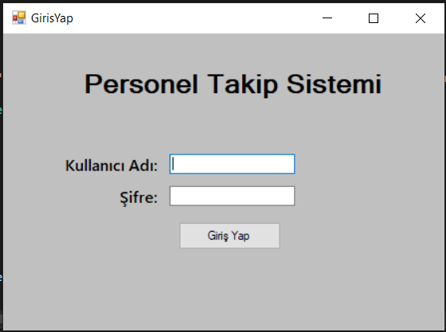
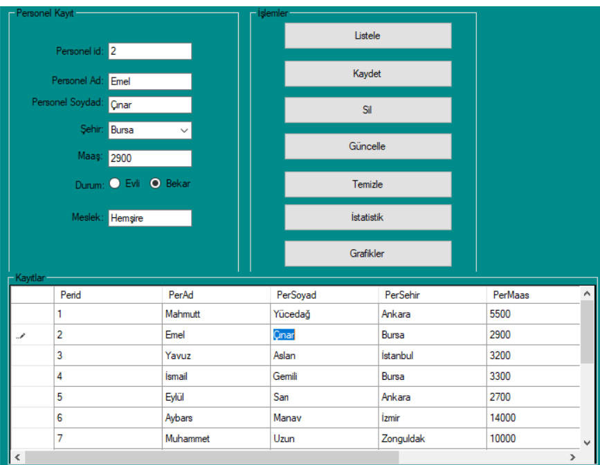
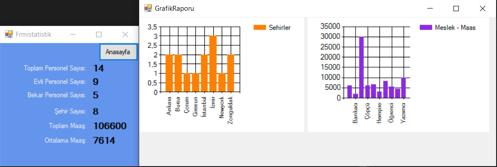

<h1>
PERSONEL TAKİP SİSTEMİ
</h1>

Personellerin bilgilerinin MSSql üzerinden alarak programımızın içerisinde işlevsel bir şekilde görüntüleme, ekleme, silme, güncelleme işlemlerini GUI desteği ile kullanıcılara sunar. Aynı zamanda personellerin hangi şehirlerde olduğunu ve onların meslek ve maaş bilgilerini grafik halinde görselleştirir.

Programı kullanabilmek için farmların içerisinde bulunan SqlConnection baglanti objesinin yapıcı metoduna ilk argüman olarak kendi data source bilginizi string olarak vermelisiniz.

Örnek bir database linkte bulunmaktadır:  <a href="https://drive.google.com/file/d/1gujF3LPiJj_JsJYCc3CvAi_8hgSe9IHW/view?usp=sharing">Personel Takip Database</a>

<h3>Admin Giriş Paneli</h3>

<h3>Anasayfa</h3>

<h3>İstatistik</h3>

